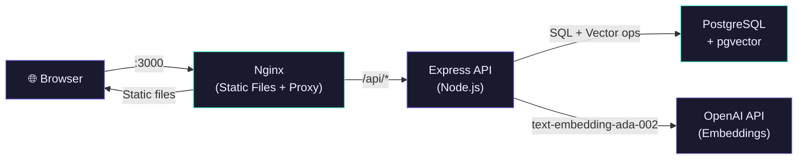

# ✦ Semantic Note Finder


A full-stack **AI-powered note-taking app** with semantic search. Write notes in natural language, then find them by *meaning* — not just keywords — using OpenAI embeddings and PostgreSQL pgvector.

---

## ✨ Features

- 🔍 **Semantic Search** — find notes by meaning using OpenAI `text-embedding-ada-002` + pgvector cosine similarity
- 🔄 **Keyword Fallback** — gracefully falls back to ILIKE search when OpenAI quota is exceeded
- 🔐 **JWT Authentication** — secure register/login with bcrypt (12 rounds) password hashing
- 🏷️ **Tag System** — organize notes with tags, filter by tag on dashboard
- 📄 **Pagination** — paginated note listing with total count
- ⚡ **Rate Limiting** — API rate limiting to prevent abuse
- 📋 **Input Validation** — express-validator on all endpoints
- 📝 **Structured Logging** — Winston logger with console + file transports
- 🐳 **Dockerized** — one-command setup with Docker Compose (backend + frontend + PostgreSQL w/ pgvector)
- 🔁 **CI/CD** — GitHub Actions pipeline for lint + build validation
- ⚠️ **Error Boundary** — graceful React error handling with fallback UI

---

## 🏗️ Architecture



---

## 🛠️ Tech Stack

| Layer | Technology |
|-------|------------|
| Frontend | React 19 + Vite |
| Backend | Node.js + Express |
| Database | PostgreSQL + pgvector |
| Embeddings | OpenAI `text-embedding-ada-002` |
| Auth | JWT + bcrypt |
| Logging | Winston |
| Containerization | Docker + Docker Compose |
| CI/CD | GitHub Actions |
| Reverse Proxy | Nginx |

---

## 🚀 Quick Start

### Option 1: Docker (Recommended)

```bash
# Clone the repo
git clone https://github.com/YOUR_USERNAME/semantic-note-finder.git
cd semantic-note-finder

# Create your .env file
cp backend/.env.example backend/.env
# Edit backend/.env — set your OPENAI_API_KEY (other vars have Docker defaults)

# Start everything
docker compose up --build

# Run the database migration (first time only)
docker compose exec backend node src/db/migrate.js
```

Open **http://localhost:3000** — that's it!

### Option 2: Manual Setup

#### Backend

```bash
cd backend
cp .env.example .env
# Edit .env: set DATABASE_URL, JWT_SECRET, OPENAI_API_KEY
npm install
node src/db/migrate.js       # Run once to set up DB schema
npm run dev                  # Start dev server on :5000
```

#### Frontend

```bash
cd frontend
npm install
npm run dev                  # Start on :5173
```

Open **http://localhost:5173**

---

## 📁 Project Structure

```
semantic-note-finder/
├── .github/workflows/ci.yml   # GitHub Actions CI pipeline
├── docker-compose.yml          # Full-stack Docker orchestration
├── backend/
│   ├── Dockerfile
│   ├── server.js
│   ├── .env.example
│   └── src/
│       ├── app.js              # Express app setup (CORS, rate limiting, routes)
│       ├── config/             # db.js (PostgreSQL pool), logger.js (Winston)
│       ├── db/                 # migrate.js (schema + pgvector setup)
│       ├── middlewares/        # auth.js (JWT verification)
│       ├── controllers/        # authController.js, notesController.js
│       ├── routes/             # authRoutes.js, notesRoutes.js
│       └── services/           # embeddingService.js (OpenAI integration)
└── frontend/
    ├── Dockerfile
    ├── nginx.conf              # Production nginx config
    ├── index.html
    ├── vite.config.js
    └── src/
        ├── App.jsx
        ├── index.css           # Global design system (dark mode + glassmorphism)
        ├── context/            # AuthContext.jsx
        ├── services/           # api.js (Axios + interceptors)
        ├── components/         # Navbar, NoteCard, SearchBar, ProtectedRoute, ErrorBoundary
        └── pages/              # Login, Register, Dashboard, NoteEditor, NoteView
```

---

## 🌐 API Endpoints

| Method | Endpoint | Auth | Description |
|--------|----------|------|-------------|
| POST | `/api/auth/register` | ✗ | Register a new user |
| POST | `/api/auth/login` | ✗ | Login + receive JWT |
| GET | `/api/auth/me` | ✓ | Get current user profile |
| GET | `/api/notes` | ✓ | List notes (paginated, tag filter) |
| POST | `/api/notes` | ✓ | Create note + generate embedding |
| GET | `/api/notes/:id` | ✓ | Get single note |
| PUT | `/api/notes/:id` | ✓ | Update note (re-embeds if changed) |
| DELETE | `/api/notes/:id` | ✓ | Delete note |
| POST | `/api/notes/search` | ✓ | **Semantic similarity search** |
| GET | `/api/notes/tags` | ✓ | List all user tags |
| GET | `/api/health` | ✗ | Health check |

---

## ⚙️ Environment Variables

| Variable | Description | Required |
|----------|-------------|----------|
| `DATABASE_URL` | PostgreSQL connection string | ✓ |
| `JWT_SECRET` | Secret for signing JWT tokens | ✓ |
| `JWT_EXPIRES_IN` | Token expiry (e.g. `7d`) | ✗ |
| `OPENAI_API_KEY` | OpenAI API key for embeddings | ✓ |
| `CORS_ORIGIN` | Frontend URL (default: `http://localhost:5173`) | ✗ |
| `PORT` | Backend port (default: `5000`) | ✗ |
| `NODE_ENV` | Environment (default: `development`) | ✗ |

---

## 📄 License

MIT
